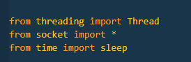
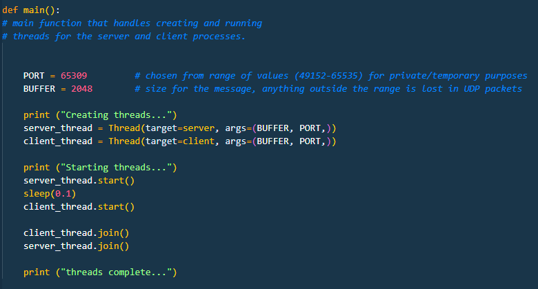
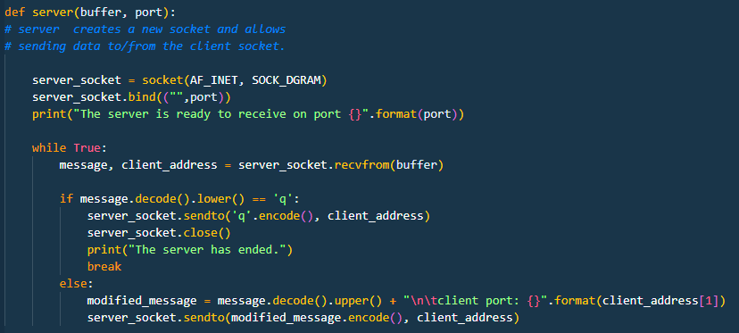
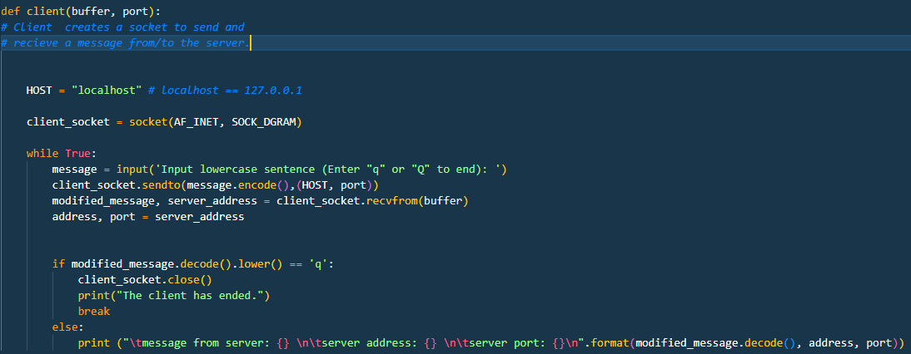
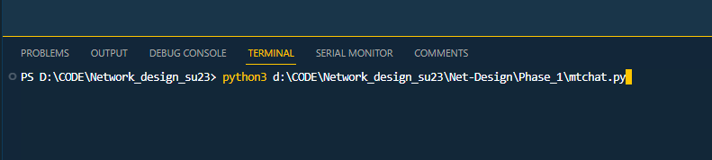
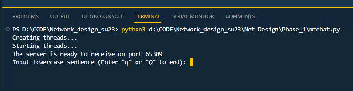
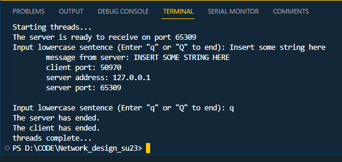

# README.md

## Title and Authors

* Phase 1

* Andre Reyes

## Purpose of the phase

## Code Explanation

* Here the threading library is used to get access to create a seperate thread for each client and server without having to use seperate files
* Socket is imported in order to assign a socket to the client and server to allow for communication through specified ports 
* time is only used for the sleep functionality

* main() is responsible for creating and running the seperate client and server threads. The options arguments passed to the threads are to have one location where the port and buffer size are determined
* A sleep function is used between client and server startup to avoid the client starting before the server. The value chosen is somewhat arbitrary.
* Using the ".join()" method allows each thread to run and continues when the other is finished

* server() is responsible for creating the sockets and listening for the client data. The server socket is in an infinite loop until the client sends a notice to quit the operation and break
* When data is recieved from the client, it is tested on quit conditions otherwise it modifies the message, adds the client port informatyion and is sent back to the client 

## Execution Example

