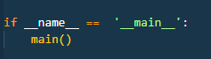

# README.md

## Title and Authors

* Phase 1

* Andre Reyes

## Purpose of the phase

## Code Explanation

* The client function is similar to the server function but does so in the opposite order.
* After the client socket is made, it waits for user input, once user input is found, it sends the data through the assigned address and port for the server socket
* it then listens to a response from the server, once a response is heard it isn't the quit value, it outputs a string with the echo/info

* This if statement at the end of the file ensures that main() is run and is needed to run script directly.

## Execution Example

