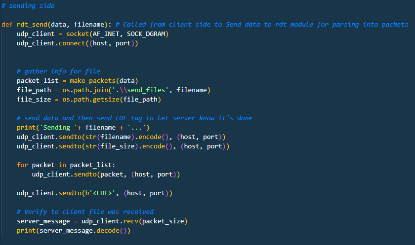
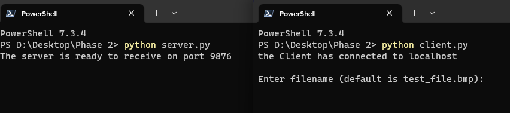

# DesignFile.md

## Title and Authors

* Phase 2

* Andre Reyes

 

## Purpose of the phase
---------------------------------------------------------------------------

### **Phase 2**
To transfer a file beterrn a UDP client process and a UDP server process. This is done by providing reliable data transfer (RDT) 1.0 service using the UDP connection developed in Phase 1. Ultimately sending and recieving data using packets, one at a time.
 

## Code Explanation
-------------------------------------------------------------------------

### **Imports**

* Here the threading library is used to get access to create a seperate thread for each client and server without having to use seperate files.
* Socket is imported in order to assign a socket to the client and server to allow for communication through specified ports.
* time is only used for the sleep functionality.

 

### **server(): Part 1**

* server() is responsible for creating the sockets and listening for the client data. 
* The server socket first receives file information sent from the client before starting file transfer.
 

### **server(): Part 2**

* When data is recieved from the client, it is tested on end conditions. otherwise it takes the packet information and appends it to a list
* Once the end condition is met, it takes the new packeet list and sends it to rdt_rcv where it will be iterated through onto a file write as binary

 

### **UDP_client.py: rdt_rcv()**

* rdt_rcv is the receiving side of the UDP-client.py and is responsible for writing the packet_list sent from the server along with the filename and appended onto a file write function
* the `with open() as ____:` is used as a safe way to open/close files without having to stat the close() method

 

### **client()**

* The client function is similar to the server function but does so in the opposite way.
* It waits for user input, once user inputs filename
it then converts the file to a list of binary values broken up in the specified buffer: 1024 bits

 

### **UDP_client.py: rdt_send()**

* rdt_send is responsible for all the network communication from the client to the server.

* Creates the sockets for communication and then sends initial file information based on the user's input file.

* Then iterates in a for loop in order to send the individual packets through the socket to the server

* Also sends a <EDF> **E**n**D** of **F**ile flag to signify to the server it is done receiving. This was chosen due to the lack of knowledge if anywhere in the packet list there were any similar flags of EOF or END, so a combination of the two was mad arbitrarily.

 

### **UDP_client.py: make_packet()**

* This function is called from rdt_send() in order to create a packet list without cluttering the main send function
* This could also be used in other ways to append various forms of data into lists in future iterations (i.e. if the server side ever sends a file back to the client)

 

## Execution Example
---------------------------------------------------------------------------
### **Command**

 

### **User Input**

 

### **Result**

