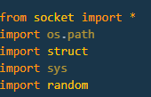
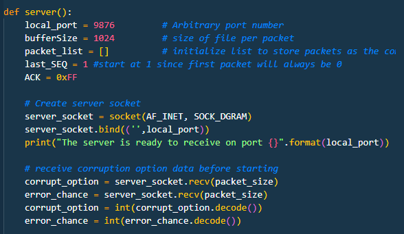
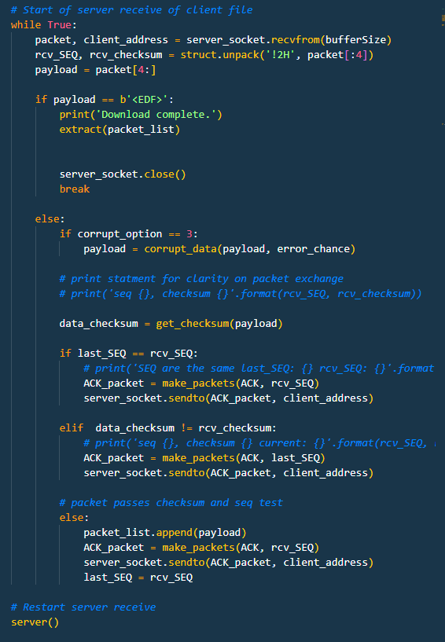
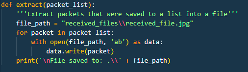
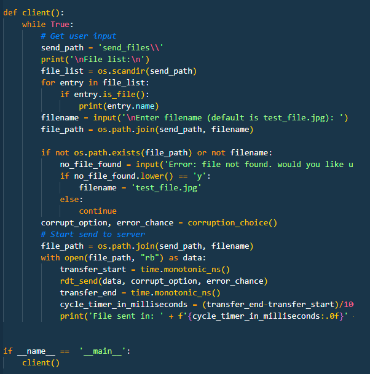
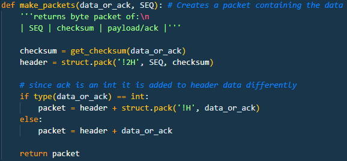
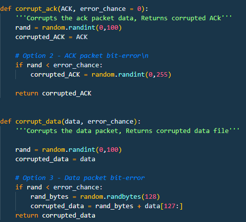
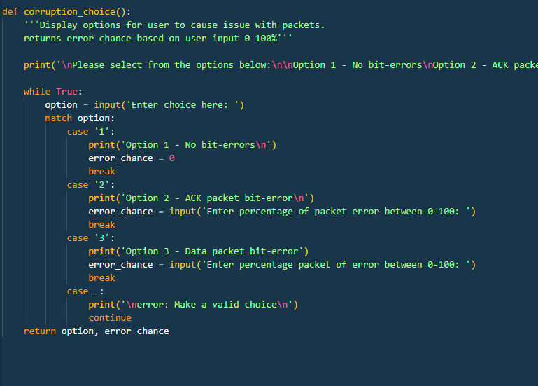
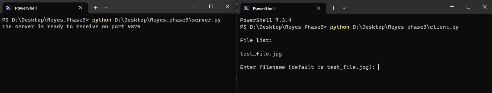
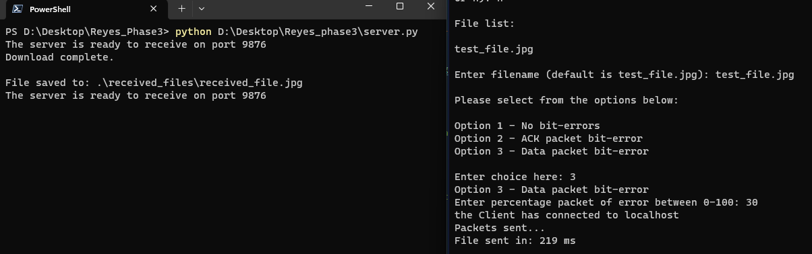

# DesignFile.md

## Title and Authors

* Phase 2

* Andre Reyes

 

## Purpose of the phase
---------------------------------------------------------------------------

### **Phase 3**
The purpose of this phase is to use the UDP sockets from Phase 2 to implement an RDT2.2 protocol that has sequence numbers, checksum and ACKs.
 

## Code Explanation
-------------------------------------------------------------------------

### **Imports**

* Time is imported to allow tracking of send/receive time
* socket imports all to make it easier on the eyes when implementing methods
* struct is used as a way to pack the data into packets that include SEQ/ACK/checksum
* sys is used primarily for helper methods for file handling
* random is used to corrupt the data with random bits witha random chance

 

### **server(): Part 1**

* server() is responsible for creating the sockets and listening for the client data. 
* The server socket first receives corruption information sent from the client before starting file transfer.
 

### **server(): Part 2**

* When data is recieved from the client, it is tested on end conditions. otherwise it takes the packet information and appends it to a list
* Once the end condition is met, it takes the new packeet list and sends it to rdt_rcv where it will be iterated through onto a file write as binary
* After taking in the corruption option, the server then attempts corrupts the data
* Once done the server tests it's data against the received data checksum/seq
* if all is good with the data and it is not corrupt it will append the good packet to a list

 

### **UDP_client.py: extract()**

* extract is the receiving side of the UDP-client.py and is responsible for writing the packet_list sent from the server along with the filename and appended onto a file write function
* the `with open() as ____:` is used as a safe way to open/close files without having to stat the close() method

 

### **client()**

* The client function is similar to the server function but does so in the opposite way.
* It waits for user input, once user inputs filename
it then converts the file to a list of binary values broken up in the specified buffer: 1024 bits

 

### **UDP_client.py: rdt_send()**

* rdt_send is responsible for all the network communication from the client to the server.

* Creates the sockets for communication and then sends initial file information based on the user's input file.

* Then iterates in a for loop in order to send the individual packets through the socket to the server

* Also sends a <EDF> **E**n**D** of **F**ile flag to signify to the server it is done receiving. This was chosen due to the lack of knowledge if anywhere in the packet list there were any similar flags of EOF or END, so a combination of the two was mad arbitrarily.

 

### **UDP_client.py: make_packets()**

* This function is called from rdt_send() in order to create a packet list without cluttering the main send function
* This could also be used in other ways to append various forms of data such as the ACK packet sent from the server with
* The SEQ number is passed at all times in order to keep track within sender/receiver sides

 

### **UDP_client.py: corrupt_ack() & corrupt_data()**

* These functions take in the data/ack and then checks if the packets should be corrupted or not based on error_chance and random values
* random method randbytes(# bits) creates a random string of bytes and then creates a new "data packet" to send back to receiver

 

### **UDP_client.py: corrupt_menu()**

* Simply takes in the user's input in order to push this info to the sender/receiver

 

## Execution Example
---------------------------------------------------------------------------
### **Command**

 

### **User Input and Results**

 

